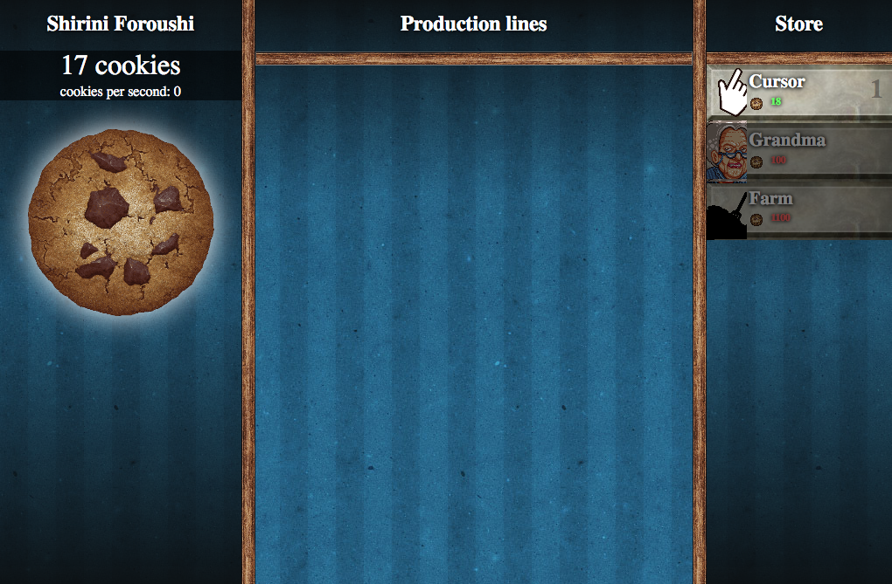

# Cookie-Clicker remake 

Projet de reproduction du jeu <a href="https://orteil.dashnet.org/cookieclicker/">"Cookie-Clicker"</a>

Difficile d'expliquer comment fonctionne le jeu, il suffit de cliquer sur le cookie pour obtenir des cookies… pour pouvoir acheter des outils qui vont produire des cookies pour avoir toujours plus de cookies…

<I>Le but du projet : </I> le coeur du jeu se trouve dans les classes et les objets que nous allons créer et manipuler à partir de ces classes.

 

 
 
Projet réalisé en équipe avec <a href='https://github.com/AndreiaPena'> Andreia </a> et <a href='https://github.com/TAJIK-samira'>Samira</a>.
